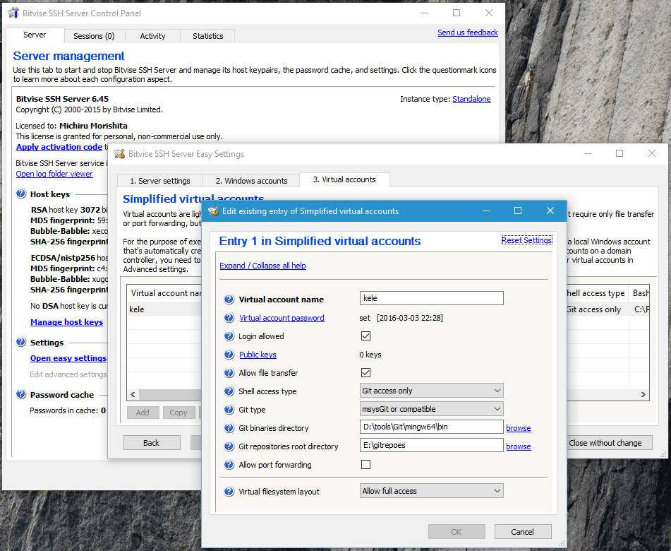

# 在 Windows 上搭建 Git 服务器


尽管 Github 不错，但在没有网络，或者不愿意把自己丑陋的代码拿给大家参观的时候，自己搞个 Git Server 还是必须的。在 Windows 上搭建一个 Git 服务器端比我想想中的简单，当然，这归功于某些软件确实做的不错。

在考虑要折腾这个之后，在网上搜了搜，有不少现成的 Git Server 软件，功能不一，需求也不同。但我觉得不需要搞这么复杂，应该 SSH Server + Git 就好。在 Windows 上跑一个 SSH Server 也有很多软件可以帮你，最终我选择了 [Bitvise SSH Server](https://www.bitvise.com/ssh-server)。理由嘛，单纯因为它最近有过更新，个人使用免费。

然后，Server 上也需要安装 Git 软件。因为是 Windows，自然是 [Git for Windows 2.x](https://git-for-windows.github.io/)。以前似乎叫 msysgit 来着。当然 Cygwin 里的 Git 应该也可以，但是我不想碰 Cygwin。所以服务起上需要：

- Bitvise SSH Server

  > 我用的是win 10 去官网下载 BvSshServer-Inst-8.17,  不要安装 8.0之前的版本，会出现连接失败的问题。

- Git for Windows

  > 安装Git 就可以了，我们要用的git bash，至于如何在window下美好git bash以及git如何开始，见我github上git-window的文章。

安装 Bitvise SSH Server 和 Git 时的选项都很随意，能用就好。Git 不需要特别的配置，甚至都不需要把路径添加到 PATH。Bitvise SSH Server 安装好之后会随系统启动，并且会在右下角添加控制台的图标。双击打开设置窗口。




找到 Settings > Open easy settings，打开它。这里可以设置哪些账户可以登录 SSH，可以是 Windows 账户，或者是虚拟账户（Vistual accounts）。所谓的虚拟账户，顾名思义，就是由 Bitvise SSH Server 管理的账户。看起来虚拟账户比较简单，我们来新建一个。

接下来配置这个虚拟账户的属性：

- 为其添加密码是非常省事的做法，这样可以不用折腾 SSH Key（但我推荐使用它，可以免密）。
- 为了稍微安全一点， Shell access type 选择 Git access only。
- Git type 自然是 msysGit or compatible。
- Git binaries directiry 是 git-receive-pack.exe 等程序所在的目录，对于我的 Git for win 2.7.2，路径是 <path-to-git>\mingw64\bin。
- Git repositories root directory 是存放 Git 项目的路径，随意。
- 设置可以根据需要调整，主要是，如果不是自己用，需要保证安全性。我不在乎，因为我那台 PC 都没接入互联网。

最后，在服务器端，Git 项目的存放路径下，运行：

``` git init --bare <my_repo_name> ```

> bare : 空的，赤裸的

接下来去客户端计算机，就能 clone 或者 push 到这个 repo 啦。

``` git clone ssh://<user>@<ip-of-server>/<my_repo_name>```