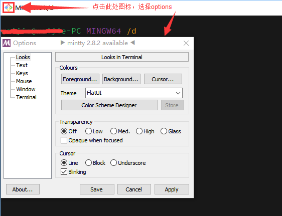
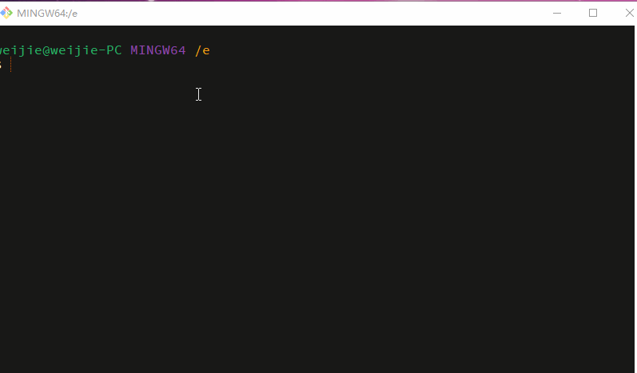
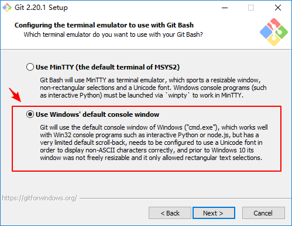

# 美化windows 10下git bash窗口

> 原文： http://jesuswasrasta.com/gitpills/git-pills-customize-your-windows-git-shell-mintty.html

由于window下git bash默认配色偏暗，字颜色难以分辨，看久了就比较疲劳，因此需要美好window下git bash窗口。

### git bash下修改起始符（非必需，不建议修改）

配置位置 ： *`C:\Program Files\Git\etc\profile.d\git-prompt.sh`*

注： `33m\`表示颜色

### git bash配色方案



1.  在用户的目录下创建 .mintty文件夹，里面 themes文件夹表示风格，FlatUI比较推荐，颜色不会偏暗。
> 例如：  C:\Users\<username>\.mintty\themes

2.  你可以从下方下载 配色风格，放入 上方的themes文件夹下，然后应用它即可。

- [https://github.com/geoffstokes/base16-mintty ](https://github.com/geoffstokes/base16-mintty)
- <https://github.com/iamthad/base16-mintty/tree/master/mintty>
- <https://github.com/oumu/mintty-color-schemes>
- <https://github.com/mavnn/mintty-colors-solarized>
- <https://github.com/PhilipDaniels/mintty/tree/master/themes>

3. 支持显示中文界面：在左侧菜单 『window』的设置 中，设置最下面界面语言为： zh_CN

### CLI中的字符编码

使用git命令操作时，中文字符往往显示乱码，显得很别扭，只需在『文本』中设置一下即可，方法如下：

在菜单『 Text』 中，将字体设置为自己喜欢的（我用的是Source Code Pro Medium），字体选项中，勾选了字体平滑，这样字体会更圆润，没有毛边的感觉。

最重要的：本地local-中选择 zh_CN , 字符集选择：utf-8 。

这样git命令中中文字符和目录路径中的中文字符，就显示一致了，效果完美。




### git命令中的中文显示“乱码”

以上的设置，只是在git-bash这个软件界面上实现了 字符正常显示，但是git内部的命令行中的中文仍然会显示“乱码”。

```bash
> git status
modify "data/python\345\255\246\344\271\240\350\265\204\346\226\231.wiki"
# 例如，上面的字符不能正常显示中文 ，这显然是git本身设置问题
```

解决办法：

```bash
git config --global core.quotepath false
```

### git-bash的terminal中输出不是彩色的

当你在window10运行`npm start --colors` 发现输出的字符颜色是非彩色的，这说明安装的时候选择了 mintty，因为它的彩色支持与windows不兼容，因此，重新安装git，记得选择**Use Windows default console window！**

> 原因解释：https://stackoverflow.com/questions/48749738/how-do-i-get-colorized-output-on-my-windows-git-bash-terminal



> 注：其实上述情况很复杂，还可能是webpack中所用的support-colors 组件有关，根据support-colors的文档说明，当你在环境变量上设置：FORCE_COLOR=2 时，node命令 无论加不加 --color参数，node就会强制使用彩色命令在控制台terminal输出。


### 在命令行中打开当前资源管理器

#### win：

```
start .
```

#### MAC：

```
open .
```


### 写在最后

我推荐使用 typora 作为md文件的编辑器，并把 它的图片设置成 `优先使用相对路径`，这样就可以在github上不必操心图片的显示问题了。

> 希望 typora 增强 bash64的图片选项